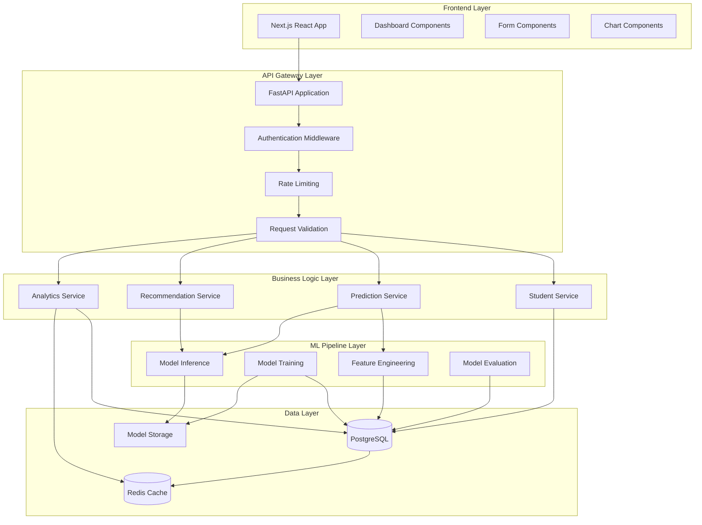

# Design Document

## Overview

The Academic Performance Prediction System is designed as a full-stack application with a Python FastAPI backend serving AI/ML capabilities and a Next.js React frontend providing an intuitive user interface. The system employs a microservices-oriented architecture with clear separation between data processing, machine learning, and presentation layers.

The architecture leverages PostgreSQL for persistent data storage, Redis for caching and session management, and scikit-learn/XGBoost for machine learning models. The system is designed to handle CBSE-specific academic data structures and provide real-time predictions with high accuracy and performance.

## Architecture

### System Architecture Diagram



### Technology Stack

**Frontend:**
- Next.js 14 with TypeScript
- React 18 with hooks and context
- Tailwind CSS with Radix UI components
- Recharts for data visualization
- React Hook Form with Zod validation

**Backend:**
- Python 3.11+ with FastAPI
- Pydantic for data validation
- SQLAlchemy for ORM
- Alembic for database migrations
- Celery for background tasks

**Database & Caching:**
- PostgreSQL 15+ for primary data storage
- Redis 7+ for caching and session storage

**Machine Learning:**
- scikit-learn for traditional ML algorithms
- XGBoost for gradient boosting models
- Optuna for hyperparameter optimization
- NumPy and Pandas for data processing

**Infrastructure:**
- Docker for containerization
- Nginx for reverse proxy
- Gunicorn for WSGI server

## Components and Interfaces

### Frontend Components

#### 1. Authentication Components
- **LoginForm**: Handles student authentication
- **RegisterForm**: Student registration with CBSE-specific fields
- **ProtectedRoute**: Route protection wrapper

#### 2. Dashboard Components
- **DashboardLayout**: Main dashboard container
- **PerformanceOverview**: Summary cards and key metrics
- **SubjectPerformanceChart**: Subject-wise performance visualization
- **PredictionDisplay**: AI predictions with confidence intervals
- **RecommendationPanel**: Personalized study recommendations

#### 3. Data Input Components
- **AcademicRecordForm**: Exam score input with CBSE validation
- **StudyHabitsTracker**: Study session logging interface
- **ProfileManagement**: Student profile editing

#### 4. Analytics Components
- **TrendAnalysis**: Historical performance trends
- **ComparativeAnalysis**: Peer comparison charts
- **ProgressTracking**: Goal setting and tracking

### Backend Services

#### 1. Student Service (`/api/students`)
```python
class StudentService:
    async def create_student(student_data: StudentCreate) -> Student
    async def get_student(student_id: int) -> Student
    async def update_student(student_id: int, updates: StudentUpdate) -> Student
    async def get_student_profile(student_id: int) -> StudentProfile
```

#### 2. Academic Records Service (`/api/academic-records`)
```python
class AcademicRecordsService:
    async def add_exam_record(record: ExamRecordCreate) -> ExamRecord
    async def get_student_records(student_id: int) -> List[ExamRecord]
    async def update_record(record_id: int, updates: ExamRecordUpdate) -> ExamRecord
    async def validate_cbse_scores(scores: Dict[str, float]) -> bool
```

#### 3. Prediction Service (`/api/predictions`)
```python
class PredictionService:
    async def generate_predictions(student_id: int) -> PredictionResult
    async def get_prediction_history(student_id: int) -> List[PredictionResult]
    async def update_prediction_accuracy(prediction_id: int, actual_score: float) -> None
```

#### 4. Recommendation Service (`/api/recommendations`)
```python
class RecommendationService:
    async def generate_study_recommendations(student_id: int) -> List[StudyRecommendation]
    async def track_recommendation_effectiveness(recommendation_id: int, feedback: FeedbackData) -> None
```

#### 5. ML Pipeline Service
```python
class MLPipelineService:
    async def train_models() -> ModelTrainingResult
    async def evaluate_model_performance() -> ModelEvaluationResult
    async def feature_engineering(student_data: StudentData) -> FeatureVector
    async def predict_performance(features: FeatureVector) -> PredictionOutput
```

### API Endpoints

#### Authentication Endpoints
- `POST /api/auth/login` - Student login
- `POST /api/auth/register` - Student registration
- `POST /api/auth/logout` - Logout
- `GET /api/auth/me` - Get current user

#### Student Management
- `GET /api/students/{student_id}` - Get student profile
- `PUT /api/students/{student_id}` - Update student profile
- `GET /api/students/{student_id}/dashboard` - Dashboard data

#### Academic Records
- `POST /api/academic-records` - Add exam record
- `GET /api/academic-records/student/{student_id}` - Get student records
- `PUT /api/academic-records/{record_id}` - Update record
- `DELETE /api/academic-records/{record_id}` - Delete record

#### Predictions
- `POST /api/predictions/generate/{student_id}` - Generate new predictions
- `GET /api/predictions/student/{student_id}` - Get predictions
- `GET /api/predictions/{prediction_id}` - Get specific prediction

#### Recommendations
- `GET /api/recommendations/student/{student_id}` - Get recommendations
- `POST /api/recommendations/feedback` - Submit recommendation feedback

#### Analytics
- `GET /api/analytics/performance-trends/{student_id}` - Performance trends
- `GET /api/analytics/subject-analysis/{student_id}` - Subject-wise analysis
- `GET /api/analytics/peer-comparison/{student_id}` - Peer benchmarking

## Data Models

### Core Entities

#### Student Model
```python
class Student(BaseModel):
    id: int
    email: str
    name: str
    cbse_board_code: str
    current_class: int  # 9, 10, 11, 12
    school_name: str
    school_code: str
    academic_year: str
    date_of_birth: date
    gender: str
    created_at: datetime
    updated_at: datetime
```

#### Academic Record Model
```python
class ExamRecord(BaseModel):
    id: int
    student_id: int
    exam_type: ExamType  # UNIT_TEST, MID_TERM, FINAL, BOARD
    subject: str
    score: float
    max_score: float
    exam_date: date
    academic_year: str
    term: str  # FIRST_TERM, SECOND_TERM
    created_at: datetime
```

#### Prediction Model
```python
class PredictionResult(BaseModel):
    id: int
    student_id: int
    subject: str
    predicted_score: float
    confidence_score: float
    prediction_date: datetime
    model_version: str
    features_used: Dict[str, Any]
    actual_score: Optional[float] = None
```

#### Study Habits Model
```python
class StudySession(BaseModel):
    id: int
    student_id: int
    subject: str
    duration_minutes: int
    study_method: str
    effectiveness_rating: int  # 1-5 scale
    session_date: datetime
    notes: Optional[str] = None
```

#### Recommendation Model
```python
class StudyRecommendation(BaseModel):
    id: int
    student_id: int
    recommendation_type: RecommendationType
    subject: str
    content: str
    priority: int  # 1-5 scale
    estimated_impact: float
    created_at: datetime
    implemented: bool = False
```

### Database Schema Design

#### Students Table
```sql
CREATE TABLE students (
    id SERIAL PRIMARY KEY,
    email VARCHAR(255) UNIQUE NOT NULL,
    password_hash VARCHAR(255) NOT NULL,
    name VARCHAR(255) NOT NULL,
    cbse_board_code VARCHAR(10) NOT NULL,
    current_class INTEGER CHECK (current_class IN (9, 10, 11, 12)),
    school_name VARCHAR(255) NOT NULL,
    school_code VARCHAR(20),
    academic_year VARCHAR(10) NOT NULL,
    date_of_birth DATE NOT NULL,
    gender VARCHAR(10),
    created_at TIMESTAMP DEFAULT CURRENT_TIMESTAMP,
    updated_at TIMESTAMP DEFAULT CURRENT_TIMESTAMP
);
```

#### Academic Records Table
```sql
CREATE TABLE academic_records (
    id SERIAL PRIMARY KEY,
    student_id INTEGER REFERENCES students(id) ON DELETE CASCADE,
    exam_type VARCHAR(20) NOT NULL,
    subject VARCHAR(100) NOT NULL,
    score DECIMAL(5,2) NOT NULL,
    max_score DECIMAL(5,2) NOT NULL,
    exam_date DATE NOT NULL,
    academic_year VARCHAR(10) NOT NULL,
    term VARCHAR(20) NOT NULL,
    created_at TIMESTAMP DEFAULT CURRENT_TIMESTAMP,
    CONSTRAINT valid_score CHECK (score >= 0 AND score <= max_score)
);
```

#### Predictions Table
```sql
CREATE TABLE predictions (
    id SERIAL PRIMARY KEY,
    student_id INTEGER REFERENCES students(id) ON DELETE CASCADE,
    subject VARCHAR(100) NOT NULL,
    predicted_score DECIMAL(5,2) NOT NULL,
    confidence_score DECIMAL(3,2) NOT NULL,
    prediction_date TIMESTAMP DEFAULT CURRENT_TIMESTAMP,
    model_version VARCHAR(50) NOT NULL,
    features_used JSONB,
    actual_score DECIMAL(5,2),
    accuracy_calculated BOOLEAN DEFAULT FALSE
);
```

## Error Handling

### Error Response Format
```python
class ErrorResponse(BaseModel):
    error_code: str
    message: str
    details: Optional[Dict[str, Any]] = None
    timestamp: datetime
```

### Error Categories

#### 1. Validation Errors (400)
- Invalid CBSE score ranges
- Missing required fields
- Invalid date formats
- Malformed request data

#### 2. Authentication Errors (401/403)
- Invalid credentials
- Expired tokens
- Insufficient permissions

#### 3. Business Logic Errors (422)
- Insufficient data for predictions
- Invalid academic year combinations
- Conflicting exam records

#### 4. System Errors (500)
- Database connection failures
- ML model loading errors
- External service timeouts

### Error Handling Strategy

#### Frontend Error Handling
```typescript
interface ApiError {
  error_code: string;
  message: string;
  details?: Record<string, any>;
}

const handleApiError = (error: ApiError) => {
  switch (error.error_code) {
    case 'VALIDATION_ERROR':
      showFormValidationErrors(error.details);
      break;
    case 'INSUFFICIENT_DATA':
      showDataRequirementMessage();
      break;
    case 'MODEL_UNAVAILABLE':
      showSystemMaintenanceMessage();
      break;
    default:
      showGenericErrorMessage();
  }
};
```

#### Backend Error Handling
```python
@app.exception_handler(ValidationError)
async def validation_exception_handler(request: Request, exc: ValidationError):
    return JSONResponse(
        status_code=400,
        content={
            "error_code": "VALIDATION_ERROR",
            "message": "Invalid input data",
            "details": exc.errors(),
            "timestamp": datetime.utcnow().isoformat()
        }
    )
```

## Testing Strategy

### Frontend Testing

#### 1. Unit Tests
- Component rendering tests using React Testing Library
- Hook functionality tests
- Utility function tests
- Form validation tests

#### 2. Integration Tests
- API integration tests
- User flow tests
- Dashboard data loading tests

#### 3. E2E Tests
- Complete user journeys using Playwright
- Cross-browser compatibility tests
- Performance tests

### Backend Testing

#### 1. Unit Tests
- Service layer tests
- Model validation tests
- Utility function tests
- ML pipeline component tests

#### 2. Integration Tests
- Database integration tests
- API endpoint tests
- ML model integration tests
- Cache integration tests

#### 3. Performance Tests
- Load testing for prediction endpoints
- Database query performance tests
- ML model inference speed tests

### ML Model Testing

#### 1. Model Validation
- Cross-validation accuracy tests
- Feature importance validation
- Prediction confidence calibration
- Model bias detection

#### 2. Data Quality Tests
- Input data validation
- Feature distribution tests
- Data drift detection
- Outlier detection

#### 3. Performance Benchmarks
- Prediction accuracy metrics
- Model inference latency
- Memory usage optimization
- Batch processing efficiency

### Test Data Management

#### 1. Synthetic Data Generation
```python
class CBSEDataGenerator:
    def generate_student_data(count: int) -> List[Student]
    def generate_academic_records(student_id: int, years: int) -> List[ExamRecord]
    def generate_realistic_score_patterns() -> Dict[str, List[float]]
```

#### 2. Test Database Setup
- Separate test database with realistic CBSE data
- Automated test data seeding
- Data cleanup after tests
- Performance test datasets

### Continuous Integration

#### 1. Automated Testing Pipeline
- Frontend tests on pull requests
- Backend tests with database migrations
- ML model validation tests
- Integration test suite

#### 2. Quality Gates
- Code coverage thresholds (>80%)
- Performance regression detection
- Security vulnerability scanning
- Accessibility compliance checks